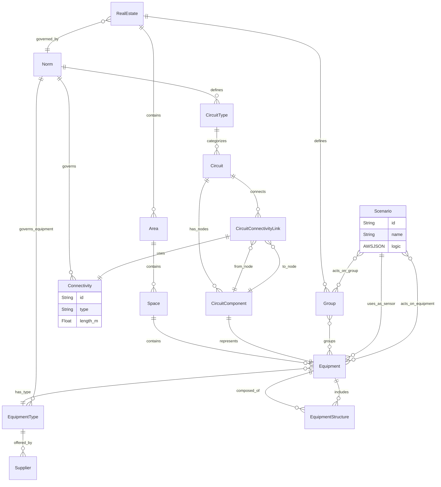

## DigitalHome Data Model — Conceptual Design Whitepaper

### Purpose
This whitepaper defines the conceptual design for the DigitalHome data model, which unites traditional real estate infrastructure with modern smart home automation. It provides the foundation for managing spaces, circuits, equipment, norms, and automation logic in a structured and scalable manner.

---

## 1. Real Estate and Physical Layout

### Entities:
- **RealEstate**: A physical property such as a house, apartment, or landholding.
- **Area**: A major subdivision of a property (e.g., house, garage, garden).
- **Space**: A specific physical location within an Area, such as a kitchen, terrace, or stairwell.

### Principles:
- Spaces can be enclosed (room, hallway) or open (balcony, stairwell).
- Each Space contains Equipment and can be linked to Circuits.

### Examples:
- RealEstate: "Villa in Aveyron", Country: France
- Area: "Main Building", "Outdoor Zone"
- Space: "Master Bedroom", "Roof Terrace", "Cellar Stairs"

---

## 2. Equipment and Bill of Materials (BOM)

### Equipment:
Represents physical devices, including passive elements (e.g., heaters, lights) and active smart devices (e.g., IoT switches, controllers).

### EquipmentType:
Classifies equipment and is defined by category, brand, and metadata. Types may be governed by specific Norms.

### BOM - EquipmentStructure:
Enables nesting and composition of Equipment into assemblies using the `EquipmentStructure` entity.

### Controllers (continued):
- Lifecycle stage classification
- Reference to documentation and icon in S3
- Supplier management

### Examples:
- **Photovoltaic System**: composed of multiple Equipment items:
  - PV Panels
  - Inverter
  - Combiner Box
  - Monitoring Unit (optional IoT)
  - Smart Meter (for grid export)
  - Mounting Structure
- This system can be represented as a top-level Equipment (Photovoltaic Plant) with child Equipment items structured through `EquipmentStructure`.
- EquipmentType: ENERGY_GENERATION, MONITORING, METERING
- Supplier: SMA, Fronius, Enphase, Victron
- S3 Bucket: Holds panel spec sheets, inverter firmware, and installation guides

---

## 3. Electrical and Data Circuits

### Circuit:
Electrical circuits—such as those for lighting, sockets, heating, or appliances—are typically defined and constrained by national Norms. These circuits are modeled using `CircuitType`, and each `Circuit` instance follows the technical standards set out in applicable regulations (e.g., NF C 15-100 for France or DIN VDE 0100 for Germany).

LAN (Local Area Network) can be modeled as a circuit when considering its physical layout, such as Ethernet cabling and distribution switches. This allows tracking wiring lengths, types (e.g., CAT6, CAT7), and connections to equipment like routers and access points.

### CircuitComponent:
Represents one Equipment within a circuit.

### CircuitConnectivityLink:
Represents the connectivity (physical or wireless) that connects two CircuitComponents. This generalized term covers traditional wiring as well as wireless protocols used in smart installations.

### Connectivity:
This entity encompasses both physical and wireless links between components. It includes copper, fiber, Ethernet, and also wireless technologies such as ZigBee, Bluetooth, or Wi-Fi where they serve as the communication or control medium between Equipment nodes.

### Features:
- Structure circuits as directed graphs
- Represent any topology (star, tree, mesh)
- Model real electrical networks and data flows

### Example:
**Kitchen Lighting Circuit**
- Components: Differential → Switch → Light Fixture 1 → Light Fixture 2
- Wiring: 3x1.5mm² Cu between each component

---

## 4. Norms and Compliance

### Norm:
Defines national or organizational standards that govern circuits, wiring, and equipment.

### CircuitType:
Defines a category or class of circuit (e.g., lighting, data network, fire detection), governed by a Norm.

### Features:
- Each RealEstate is governed by one or more Norms (e.g., NF C 15-100)
- Norms determine permitted wiring and equipment
- Supports compliance validation

### Examples:
- **NF C 15-100 (France)**: A foundational electrical norm that specifies mandatory practices for residential installations. It governs:
  - Minimum wire cross-sections (e.g., 1.5 mm² for lighting, 2.5 mm² for sockets)
  - Protection devices (e.g., mandatory use of differential breakers per circuit type)
  - CircuitType naming and limits (e.g., max 8 lighting points per circuit)
  - Approved EquipmentTypes (e.g., mandatory fire detectors, grounded outlets)
  - Acceptable Wiring materials and installation methods (e.g., embedded vs. surface-mounted)

- **DIN VDE 0100 (Germany)**: The central German norm for low-voltage electrical installations. It aligns closely with IEC standards and governs:
  - Wiring types and insulation requirements
  - Specifics for special installations (e.g., wet areas, outdoors)
  - Socket outlet placement and circuit distribution
  - Mandatory use of RCDs (residual current devices) for household protection
  - Standardized color coding and conductor designation

- **REGIE (Belgium)**: Local energy authority rules for grid connection, protection levels, and meter setup

---

## 5. Spaces and Logical Groupings

### Space:
Renamed from Room, it includes both enclosed and open areas within an Area.

### Group:
LAN can also be represented as a Group when viewed as a logical grouping of networked devices for automation, such as media servers, smart TVs, IP cameras, and access points that may be managed as a single network segment or scenario target.

Defines a logical (non-physical) grouping of Equipment, typically for automation scenarios.

### Use Cases:
- Groups simplify control logic for smart home scenarios
- One Group may span multiple Spaces and Areas

### Examples:
- Group: "Night Lighting" includes garden lights and hallway LEDs
- Group: "Ground Floor Heating" includes 3 radiator valves and a thermostat
- Group: "LAN Media Group" includes Smart TV, NAS, Wi-Fi APs

---

## 6. Automation Scenarios

### Scenario:
Represents a defined automation rule or behavioral mode involving sensors, logic, and actions.

### Controllers:
Controllers are the central brains of the smart home. They execute scenario logic and interface with both sensors and actors. Controllers are themselves a type of Equipment, typically represented as a home automation hub or software platform.

Examples include:
- HomeMatic CCU
- Home Assistant
- OpenHAB
- KNX Gateway

They manage logic evaluation, input processing, scenario scheduling, and command dispatching.

### Sensors:
Equipment that serve as input triggers (e.g., motion detectors, temperature sensors).

### Actors:
Devices or Groups that are controlled as a result of scenario execution.

### Features:
- Logic defined in JSON for condition-action flows
- Many-to-many relationships for Sensors, Actor Equipment, and Actor Groups
- Reusable, scenario-driven automation architecture
- Scenarios are executed by a central **Controller**, which is also modeled as an Equipment

### Examples:
**Scenario: "Evening Mode"**
- Sensors: Motion Sensor in Living Room
- Logic: IF motion AND time > 19:00 THEN turn on lights
- Actors: Group "Living Room Lights"

**Scenario: "Away Mode"**
- Sensors: Door Contact, Motion Sensor
- Logic: IF motion detected AND door closed AND security armed THEN alert
- Actors: Equipment: Siren, Group: All Lights

---

## Final Mermaid ER Diagram

---

## Conclusion
This extended model delivers a comprehensive and extensible framework for smart building management. It supports:
- Physical hierarchy mapping
- Engineering-level component and circuit modeling
- Country-specific compliance
- Smart home automation through Scenarios and Groups

It is ready to support visual builders, simulation tools, ERP integration, or rule-based validation engines for sustainable and scalable smart home infrastructure.