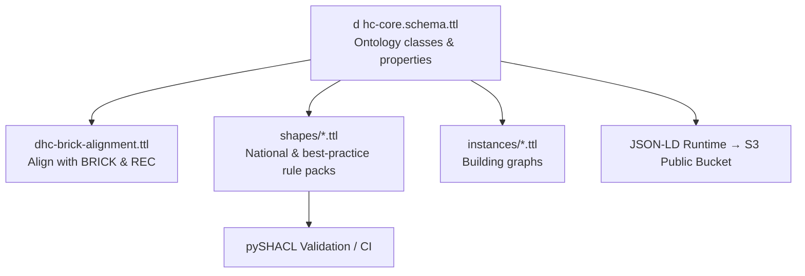

# 🏡 DigitalHome.Cloud Semantic Core

The **DigitalHome.Cloud Semantic Core** is at this stage and experimental project aiming at building an open, interoperable foundation of the DigitalHome ecosystem.  
It models how real-world spaces, circuits, and equipment relate semantically from architecture to automation 
and aligns with international building standards such as **BRICK**, **RealEstateCore**, and **IFC**.

---

## 🌍 Vision

In a world where technology advances rapidly, **DigitalHome.Cloud** enables people, devices, and AI systems to share a common understanding of homes and buildings —  
using open ontologies, reasoning, and validated rules instead of proprietary data silos.

**Key principles:**
- 🧩 *Everything is linked semantically, from physical rooms to digital models.*
- ⚖️ *Compliance and creativity coexist: regulations and best practices are expressed as SHACL shapes, not hard-coded logic.*
- 🔗 *Full BRICK compatibility for interoperability with building automation systems.*

---

## 🧱 Semantic Foundation

### Ontology
- Defined in **Turtle (`.ttl`)** under `/ontology`
- Provides classes and relationships such as:
  - `dhc:RealEstate`, `dhc:Area`, `dhc:Space`, `dhc:Equipment`, `dhc:Group`, `dhc:Scenario`
- Aligned with **BRICK Schema** (`/ontology/dhc-brick-alignment.ttl`)
- Published at runtime as **JSON-LD** to a public S3 bucket (MVP)

### SHACL Shapes
- Validation rules and national standards live under `/shapes`
- Each rule pack (e.g., **NF C 15-100**) enforces electrical and safety compliance
- Shapes extend core ontology terms, ensuring model consistency across instances

### Instances
- Real building or home graphs expressed as RDF (`.ttl`) or runtime JSON-LD
- Stored privately per tenant in protected S3 (`s3://digitalhome-cloud-protected/tenants/...`)

---

## ⚙️ Architecture Overview



**Design-time:**  
Author and validate RDF/OWL ontologies in `.ttl` on GitHub.  
CI converts and publishes JSON-LD to versioned S3 paths.

**Runtime:**  
Amplify and other DigitalHome.Cloud apps consume the public JSON-LD context;  
protected instances reference the same vocabulary for live control, analytics, and simulation.

---

## 🧩 Core Model Highlights

| Domain | Description |
|---------|--------------|
| **RealEstate / Area / Space** | Physical and spatial hierarchy of a property |
| **Equipment / EquipmentType** | Physical or virtual devices and assemblies |
| **Circuit / Connectivity** | Electrical and data networks (wired or wireless) |
| **Group** | Logical grouping for automation or energy zones |
| **Scenario** | Automation logic linking sensors, controllers, and actors |
| **Guideline / Shape** | Compliance and best-practice validation layer |

---

## 🔗 BRICK Compatibility

The Semantic Core is **natively aligned** with [Brick Schema](https://brickschema.org/):
- `dhc:Equipment` → `brick:Equipment`
- `dhc:Point` → `brick:Point`
- `dhc:Space` → `brick:Location`
- Common metadata such as `brick:hasPoint`, `brick:isPartOf`, and `brick:feeds` are reused directly.

---

## 📦 Repository Layout

```
ontology/         # Core schemas and alignments
shapes/           # Compliance & best-practice rule packs
instances/        # Example or tenant-specific graphs
scripts/          # Validation & build tools
.github/workflows # CI for validation and publishing
```

---

## 📜 Licensing & Governance

- **License:** MIT  
- **Namespace:** `https://digitalhome.cloud/ontology#` (`dhc:`)  
- **Maintainer:** DLab 5 / DigitalHome.Cloud Core Team  
- **Releases:** Semantic versioning  
  - `model-vX.Y.Z` – ontology & alignments  
  - `shapes-vX.Y.Z` – validation packs  

---